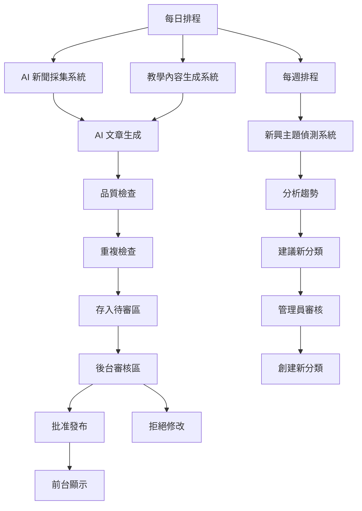

# n8n 自動化系統完整指南

## 🎯 系統概述

本系統包含三個主要的 n8n 工作流，實現內容的自動生產、審核和分類擴展：

1. **AI 新聞採集系統** (`news-curation.json`) - 每日抓取 AI 新聞並生成教學文章
2. **教學內容生成系統** (`daily-content-generation.json`) - 每日產出不同分類的免費教學
3. **新興主題偵測系統** (`category-detection.json`) - 自動偵測新主題並建議新分類

所有自動生成的內容都會先進入後台「內容審核區」，經過人工審核後才會發布。

## 📋 系統架構



## 🚀 工作流詳細說明

### 1. AI 新聞採集系統

**檔案**: `n8n-workflows/news-curation.json`

**執行頻率**: 每日一次 (可自訂時間)

**工作流程**:

```
排程觸發 → 多源新聞抓取 → RSS 解析 → 品質篩選 → 相關性評分
→ AI 文章生成 → 格式化 → 品質驗證 → 重複檢查 → 存入待審區 → 發送通知
```

**新聞來源**:
- Google News RSS (繁體中文)
- 搜尋關鍵詞: AI, GPT, ChatGPT, 機器學習, 深度學習, 人工智慧

**智能篩選機制**:

| 篩選條件 | 說明 |
|---------|------|
| 標題長度 | > 10 字元 |
| 內容描述 | > 50 字元 |
| 發布時間 | 48 小時內 |
| 相關性評分 | ≥ 70 分 |

**相關性評分規則**:

```javascript
高優先級關鍵詞 (+20分):
- ChatGPT, GPT-4, Claude, AI 工具, 提示詞, 應用, 教學, 入門, 新手, 使用方法

中優先級關鍵詞 (+10分):
- 機器學習, 深度學習, 人工智慧, AI 技術, 研究, 發展

低優先級關鍵詞 (-15分):
- 股票, 財報, 併購, 公司, 市場, 投資
```

**品質檢查項目**:
- ✓ 標題是否足夠吸引人
- ✓ SEO 標題是否包含關鍵詞
- ✓ 是否包含完整的 AEO 欄位
- ✓ FAQ 是否至少 3 組
- ✓ 內容長度是否充足 (>500 字)
- ✓ 是否包含遊戲化元素

### 2. 教學內容生成系統

**檔案**: `n8n-workflows/daily-content-generation.json`

**執行頻率**: 每日一次

**工作流程**:

```
排程觸發 → 獲取分類列表 → 分類分發器 → 搜尋網路資源 → 提取資源摘要
→ AI 內容生成 → 解析格式化 → 品質檢查 → 重複檢查 → 存入待審區 → 發送通知
```

**分類循環機制**:

根據日期自動循環選擇分類，確保每個分類都有內容產出：

```javascript
const categories = [
  { name: '入門心法', difficulty: 1 },
  { name: '長輩友善', difficulty: 2 },
  { name: '生活應用', difficulty: 2 },
  { name: '工作效率', difficulty: 3 },
  { name: '進階技巧', difficulty: 5 }
];

// 每天選擇 2-3 個分類
const dayOfYear = Math.floor((today - new Date(today.getFullYear(), 0, 0)) / (1000 * 60 * 60 * 24));
const selectedIndex = dayOfYear % categories.length;
```

**難度漸進設計**:

| 分類 | 難度 | 內容焦點 | 目標讀者 |
|------|------|---------|---------|
| 入門心法 | ★☆☆☆☆ | 基礎概念 | 完全新手 |
| 長輩友善 | ★★☆☆☆ | 簡單應用 | 60+ 歲長輩 |
| 生活應用 | ★★☆☆☆ | 實用場景 | 一般用戶 |
| 工作效率 | ★★★☆☆ | 生產力提升 | 職場人士 |
| 進階技巧 | ★★★★★ | AI 人設、複雜工作流 | 經驗用戶 |

**遊戲化學習元素**:

1. **挑戰機制**
   ```
   💡 挑戰：試試看用今天學到的技巧，解決一個你日常遇到的問題！
   ```

2. **解鎖提示**
   ```
   ✨ 完成本篇後，你已掌握 [技能名稱]！
   解鎖下一難度：[下一級別名稱]
   ```

3. **實作步驟**
   - 每篇文章包含 4 個具體步驟
   - 從基礎設定到實際應用
   - 可立即執行的操作指導

**網路資源搜尋**:

使用 Bing Search API 搜尋相關資源：

```javascript
搜尋參數:
- 關鍵詞: 分類 keywords[0] + "AI 教學 初學者"
- 語言: 繁體中文 (zh-TW)
- 數量: 5 筆
```

### 3. 新興主題偵測系統

**檔案**: `n8n-workflows/category-detection.json`

**執行頻率**: 每週一次

**工作流程**:

```
排程觸發 → 獲取近期內容 → 分析趨勢 → 獲取現有分類 → AI 建議生成
→ 解析建議 → 過濾新分類 → 保存建議 → 發送通知
```

**趨勢分析**:

統計過去 50 篇文章的關鍵詞和語義標籤頻率：

```javascript
// 高頻關鍵詞定義
出現頻率 ≥ 3 次 → 判斷為潛在新主題
```

**AI 分類建議**:

系統會分析並建議是否創建新分類：

```json
{
  "should_create_category": true,
  "suggested_categories": [
    {
      "name": "AI 視覺藝術",
      "reason": "最近 10 篇文章都與 AI 圖像生成相關，現有分類無法涵蓋",
      "related_keywords": ["Midjourney", "DALL-E", "圖像生成", "AI繪畫"],
      "difficulty_level": 3
    }
  ]
}
```

## 🔧 後台審核系統

**路由**: `/admin/insights/review`

**功能**:

### 統計面板
- 總文章數
- 待審核數量
- 已批准數量
- 已拒絕數量

### 文章列表
- 顯示所有待審核、已批准、已拒絕的文章
- 篩選功能：按狀態過濾
- AI 生成標記：顯示哪些文章是 AI 自動生成
- 難度等級：★ 到 ★★★★★

### 審核操作
1. **預覽** - 在新視窗中預覽文章
2. **批准** - 一鍵批准並發布
3. **拒絕** - 拒絕並要求修改（可填寫拒絕原因）
4. **批量批准** - 一次性批准所有待審文章

### 品質指標
- 品質評分 (0-100)
- 品質問題列表
- 驗證結果

## 📝 設置步驟

### 步驟 1: 數據庫遷移

```bash
# 應用數據庫遷移
supabase db push
```

新增欄位:
- `ai_generated` - 標記 AI 生成內容
- `difficulty_level` - 難度等級 1-5
- `quality_score` - 品質評分
- `quality_issues` - 品質問題列表
- `review_notes` - 審核筆記
- `validation` - 驗證結果

新增表:
- `category_suggestions` - 分類建議

### 步驟 2: 安裝 n8n

```bash
# 使用 Docker 安裝 n8n
docker run -it --rm \
  --name n8n \
  -p 5678:5678 \
  -v ~/.n8n:/home/node/.n8n \
  n8nio/n8n
```

### 步驟 3: 匯入工作流

1. 開啟 n8n Dashboard: `http://localhost:5678`
2. 點擊「Import from File」
3. 分別匯入三個 JSON 工作流文件:
   - `news-curation.json`
   - `daily-content-generation.json`
   - `category-detection.json`

### 步驟 4: 配置認證資訊

每個工作流都需要配置以下認證：

#### OpenAI API
1. 在 n8n 中新增 Credential
2. 類型: OpenAI API
3. API Key: `your-openai-api-key`

#### Supabase
替換工作流中的佔位符:
```json
"YOUR_SUPABASE_ANON_KEY" → "你的 Supabase Anon Key"
```

#### Bing Search API (選用)
用於教學內容生成時的網路資源搜尋:
1. 在 Azure 創建 Bing Search 資源
2. 獲取 API Key
3. 替換工作流中的 `YOUR_BING_API_KEY`

#### Email (選用)
配置 SMTP 設定以發送通知郵件

### 步驟 5: 測試工作流

1. 在 n8n 中手動執行工作流
2. 檢查執行日誌
3. 驗證 Supabase 中的數據
4. 確認後台審核區有新文章

### 步驟 6: 啟用自動排程

1. 在每個工作流中調整排程時間:
   - 新聞採集: 每日 09:00
   - 教學生成: 每日 10:00
   - 分類偵測: 每週一 09:00

2. 點擊「Activate」啟用工作流
3. 確認工作流狀態為 Active

## 📊 內容品質標準

### AI 生成內容必須包含

✅ **基本欄位**
- 標題 (10+ 字元)
- 摘要 (150-200 字)
- 內容 (500+ 字)
- 閱讀時間估算

✅ **AEO 欄位**
- SEO 標題 (50-60 字元)
- 關鍵詞 (3-8 個)
- 搜尋意圖
- 目標讀者
- 生活痛點
- 應用場景
- 解決方案
- 錯誤/正確範例
- FAQ (至少 3 組)
- 語義標籤

✅ **遊戲化元素**
- 學習挑戰
- 解鎖提示
- 鼓勵性語氣

✅ **結構完整性**
- 由淺入深的順序
- 具體可執行的步驟
- 實際範例對比

### 品質評分系統

```
基礎分: 50 分
必填欄位完整: +20 分
內容長度充足: +10 分
FAQ 足夠: +10 分
遊戲化元素: +10 分

扣分項:
- 缺少必填欄位: -10 分/欄位
- 內容太短: -20 分
- FAQ 不足: -10 分
- 缺少遊戲化: -10 分
```

## 🎮 學習路徑與遊戲化

### 難度進階路徑

```
Level 1: 入門心法 ★☆☆☆☆
    ↓ 閱讀 3 篇後解鎖
Level 2: 長輩友善 ★★☆☆☆
Level 2: 生活應用 ★★☆☆☆
    ↓ 各閱讀 3 篇後解鎖
Level 3: 工作效率 ★★★☆☆
    ↓ 閱讀 5 篇後解鎖
Level 5: 進階技巧 ★★★★★
```

### 徽章系統

| 徽章 | 條件 |
|------|------|
| 🌱 新手探索者 | 閱讀 1 篇文章 |
| 🔥 連續學習者 | 連續 7 天閱讀 |
| ⭐ 學習之星 | 完成所有難度等級 |
| 🏆 AI 大師 | 閱讀 50+ 篇文章 |
| 💎 專家級 | 通過所有進階技巧內容 |

## 🔍 監控與優化

### 每日檢查

1. **新聞採集結果**
   - 是否有新文章生成
   - 品質評分是否達標
   - 是否有重複內容

2. **教學生成結果**
   - 是否按計劃生成內容
   - 分類分佈是否均衡
   - 難度設計是否合理

### 每週檢查

1. **內容品質趨勢**
   - 平均品質評分
   - 批准率
   - 拒絕原因分析

2. **分類建議**
   - 是否有新分類建議
   - 建議是否合理
   - 是否需要創建新分類

### A/B 測試建議

- 測試不同生成 Prompt 的品質差異
- 測試不同排程時間的用戶反應
- 測試遊戲化元素的效果

## 🛡️ 安全與品質控制

### 人工審核要求

✅ **必須人工審核的情況**
- 所有 AI 生成內容
- 品質評分 < 80 的內容
- 包含敏感主題的內容
- 技術準確性不確定的內容

### 自動拒絕規則

❌ **自動拒絕的內容**
- 品質評分 < 60
- 缺少核心 AEO 欄位
- 與現有文章重複度 > 80%
- 包含違規內容

### 異常警報

- API 失敗通知
- 生成內容異常通知
- 品質評分過低警報
- 重複率過高警報

## 📚 相關文檔

- [內容結構化指南](./CONTENT_STRUCTURE_GUIDE.md)
- [數據同步指南](./DATA_SYNC_GUIDE.md)
- [SEO + AEO 最佳實踐](./SEO_AEO_BEST_PRACTICES.md)
- [n8n 官方文檔](https://docs.n8n.io/)
- [Supabase REST API](https://supabase.com/docs/guides/api)

## 🐛 故障排除

### 常見問題

**Q: 工作流執行失敗？**
A: 檢查 API 金額、網路連線、認證設定

**Q: 生成內容品質不佳？**
A: 調整 Prompt 模板、增加品質閾值

**Q: 重複內容過多？**
A: 加強去重檢查邏輯、調整篩選條件

**Q: 分類建議不合理？**
A: 調整頻率閾值、優化 AI 分析 Prompt

### Debug 工具

1. **n8n 執行日誌**
   - 查看每個節點的輸入輸出
   - 檢查錯誤訊息

2. **Supabase 查詢**
   ```sql
   -- 查看 AI 生成內容
   SELECT * FROM insights WHERE ai_generated = true;

   -- 查看品質評分分佈
   SELECT quality_score, COUNT(*) FROM insights
   WHERE ai_generated = true
   GROUP BY quality_score;

   -- 查看分類建議
   SELECT * FROM category_suggestions
   WHERE status = 'pending';
   ```

3. **後台審核區**
   - 即時查看待審文章
   - 檢查品質問題
   - 手動審核測試

---

**文檔版本**: 1.0
**最後更新**: 2025-01-27
**維護者**: Dee 網站開發團隊
