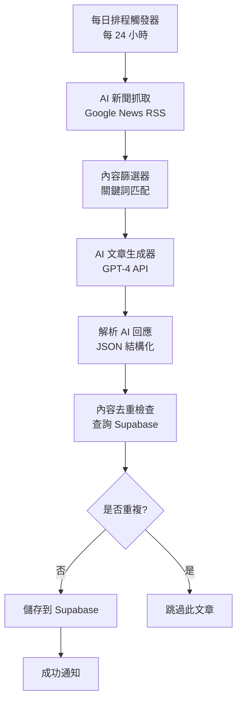

# AI 內容自動生產系統

## 🎯 系統目標

建立一個自動化的內容生產流程，解決前端與後端內容不一致問題，確保免費教學文章持續更新並符合 SEO + AEO 優化標準。

## 📋 系統需求

### 1. 每日 AI 新聞抓取與篩選
- 從 Google News RSS 自動抓取 AI 相關新聞
- 篩選條件：
  - 包含關鍵詞：AI、GPT、ChatGPT、Claude、機器學習、深度學習、人工智能
  - 繁體中文優先
  - 發布時間在 24 小時內

### 2. AI 文章自動生成
- 使用 GPT-4 根據新聞內容生成結構化教學文章
- 必須包含完整的 AEO 欄位：
  - `seo_title` - SEO 標題
  - `keywords` - 關鍵詞數組
  - `search_intent` - 搜尋意圖
  - `target_audience` - 目標讀者
  - `pain_point` - 生活痛點
  - `scenario` - 應用場景
  - `solution` - AI 解決方案
  - `example` - 錯誤/正確範例
  - `faq` - 常見問答（至少 3 組）
  - `semantic_tags` - 語義標籤

### 3. 分類策略與遊戲化設計
分類及難度階梯：
1. **入門心法** (難度 1) - 基礎提示詞概念
2. **長輩友善** (難度 2) - 簡單日常應用
3. **生活應用** (難度 2) - 實用場景
4. **工作效率** (難度 3) - 生產力提升
5. **進階技巧** (難度 5) - 高級 AI 人設

遊戲化機制：
- 每天至少生產每個分類一篇
- 用戶閱讀完文章後解鎖下一難度級別
- 文章標題顯示「難度星級」★ 到 ★★★★★★
- 完成文章後獲得「技能徽章」

### 4. 內容去重檢查
- 檢查 Supabase 中是否已存在相同標題或關鍵詞組合的文章
- 避免重複內容，確保新穎性

### 5. 自動偵測新分類
- 定期分析生成內容的主題
- 當某主題出現頻率超過閾值（如 10 次），建議建立新分類
- 管理員可於後台手動確認並建立新分類

## 🔄 n8n 工作流程圖



## 📊 數據結構一致性

### 前端 ArticleDetail.tsx 期望的結構：
```typescript
{
  id: number;
  category: string;
  title: string;
  summary: string;
  content: string;
  read_time: string;
  // AEO fields
  seo_title: string;
  keywords: string[];
  search_intent: string;
  target_audience: string;
  pain_point: string;
  scenario: string;
  solution: string;
  example: { wrong: string; right: string };
  faq: { question: string; answer: string }[];
  semantic_tags: string[];
}
```

### n8n 生成的內容格式：
JSON 回應必須完全匹配上述結構，確保前端能正確顯示。

## 🎨 前端呈現方式參考

根據 `ArticleDetail.tsx` 的實現，前端會按順序顯示：

1. **文章頭部**
   - 分類標籤（彩色）
   - 閱讀時間
   - 標題
   - 摘要

2. **結構化內容區塊**（帶動畫效果）
   - 🔴 生活痛點（紅色漸變背景）
   - 🟡 應用場景（黃色漸變背景）
   - 🟢 AI 解決方案（綠色漸變背景）
   - 🟣 簡單實例（深色背景）
     - ❌ 錯誤示範（紅色）
     - ✅ 正確用法（綠色）
   - 📦 常見問題（深色背景）

3. **完整文章內容**（HTML 格式）
   - 使用 `dangerouslySetInnerHTML` 渲染
   - Tailwind prose 類別美化

## 🚀 實施步驟

### 步驟 1：部署 n8n 工作流
1. 開啟 n8n Dashboard (`http://localhost:5678`)
2. 匯入工作流 JSON 文件
3. 設定 OpenAI API 認證
4. 啟用工作流（設定為 Active）

### 步驟 2：測試手動執行
1. 在 n8n 中手動執行工作流
2. 檢查執行日誌，確認各節點正常運作
3. 驗證 Supabase 中是否成功插入文章

### 步驟 3：驗證前端顯示
1. 開啟前端網站
2. 導航至 `/insights` 頁面
3. 點擊新文章，確認 AEO 區塊正確顯示
4. 測試各種設備（桌面、平板、手機）

### 步驟 4：設定排程
1. 在 n8n 中將排程設為每日執行
2. 設定執行時間（如台灣時間 09:00）
3. 開啟工作流

## 📝 文章生成 Prompt 模板

以下是用於 GPT-4 的系統 Prompt：

```
你是一位專業的 AI 教育內容撰寫專家，擅長 SEO 和 AEO 優化。
請根據提供的資訊，撰寫符合以下結構的中文文章。

要求：
1. 標題要包含主要關鍵詞，並吸引搜尋意圖
2. 內容要由淺入深，適合台灣讀者
3. 每個分類每天至少一篇，內容不重複
4. 採用遊戲化語氣，鼓勵持續學習
5. 所有欄位必須填寫完整

AEO 欄位要求：
- seo_title: 包含主要關鍵詞的標題（50-60 字元）
- keywords: 5-8 個相關關鍵詞，用逗號分隔
- search_intent: 描述使用者搜尋此內容的動機
- target_audience: 明確的目標讀者群體
- pain_point: 描述讀者遇到的具體問題
- scenario: 描述典型的使用場景
- solution: 提供清楚的解決步驟
- example: 錯誤範例和正確範例對比
- faq: 至少 3 組常見問答
- semantic_tags: 5 個相關語義標籤

輸出格式：JSON object，包含以上所有欄位。
```

## 🔍 SEO + AEO 策略

### SEO 優化
1. **標題優化**：
   - 在前 60 字元內包含主要關鍵詞
   - 使用吸引人的數字和表情符號

2. **關鍵詞佈局**：
   - 標題中 1 次
   - H2 標題中 2-3 次
   - 內文中自然分布（密度 1-2%）

3. **Meta 描述**：
   - 精準的 summary（150 字元內）
   - 包含主要關鍵詞和 CTA

### AEO 優化
1. **結構化數據**：
   - 使用 JSON-LD schema.org 標記
   - 包含 FAQPage 和 Article schema

2. **問題-答案格式**：
   - 每個痛點都有明確解決方案
   - 提供具體實例，不只理論

3. **語義關聯**：
   - 使用語義標籤連結相關文章
   - 建立「相關閱讀」推薦

## 🎮 遊戲化學習設計

### 難度標示系統
- 入門心法：★☆☆☆☆
- 長輩友善：★★☆☆☆
- 生活應用：★★☆☆☆
- 工作效率：★★★☆☆
- 進階技巧：★★★★★

### 學習路徑
```
入門心法 (Level 1)
    ↓ 完成後解鎖
長輩友善 (Level 2)
    ↓ 完成後解鎖
生活應用 (Level 2)
    ↓ 完成後解鎖
工作效率 (Level 3)
    ↓ 完成後解鎖
進階技巧 (Level 5)
```

### 徽章系統
- 🌱 新手探索者（閱讀 1 篇）
- 🔥 連續學習者（連續 7 天）
- ⭐ 學習之星（完成所有難度）
- 🏆 大師級（閱讀 50+ 篇）

## 🔧 技術設定

### n8n 配置
- **執行頻率**：每 24 小時
- **時區**：Asia/Taipei
- **重試機制**：失敗後重試 3 次
- **錯誤通知**：發送 email 到管理員

### Supabase 設定
- **啟用 RLS**：確保資料安全
- **索引優化**：在 `keywords` 和 `seo_title` 建立索引
- **實時訂閱**：開啟 PostgreSQL changes feed

### OpenAI 配置
- **模型**：GPT-4-turbo-preview
- **Temperature**：0.7（創意性與準確性平衡）
- **Max Tokens**：2000（足夠撰寫完整文章）

## 📈 監控與優化

### 每週檢查項目
1. 新增文章數量（目標：每週 7+ 篇）
2. 文章分佈（目標：每分類至少 1 篇）
3. 去重效果（目標：重複率 < 5%）
4. 流量增長（目標：每週增長 10%）

### A/B 測試
- 測試不同標題格式的點擊率
- 測試 AEO 區塊不同顏色/佈局的轉化率
- 測試難度標示對用戶停留時間的影響

## 🛡️ 安全與品質控制

### 內容審核
1. 人工審核前 5 篇自動生成的文章
2. 檢查錯別字和語法錯誤
3. 確保技術準確性

### 異常檢測
- API 失敗發送警報
- 文章格式不符標準自動拒絕
- 異常關鍵詞或內容標記待審核

## 📞 支援與維護

### 常見問題
**Q：工作流執行失敗？**
A：檢查 OpenAI API 金額餘額，確認 Supabase 連線正常。

**Q：前端文章沒有更新？**
A：檢查 Supabase 的 `is_published` 欄位是否為 true。

**Q：內容重複怎麼辦？**
A：調整去重檢查邏輯，增加關鍵詞相似度算法。

## 📚 參考資源

- [n8n 官方文檔](https://docs.n8n.io/)
- [Supabase REST API 文檔](https://supabase.com/docs/guides/api)
- [Google SEO 指南](https://developers.google.com/search/docs)
- [Schema.org 規範](https://schema.org/)

---

**文件版本**：1.0  
**最後更新**：2025-01-27  
**維護者**：Dee 網站開發團隊
